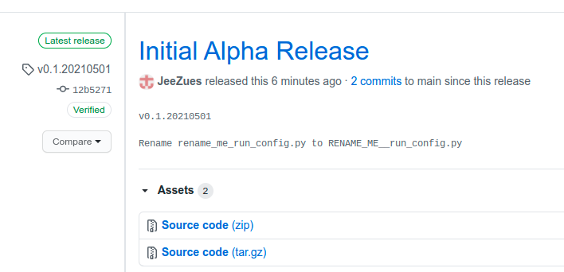
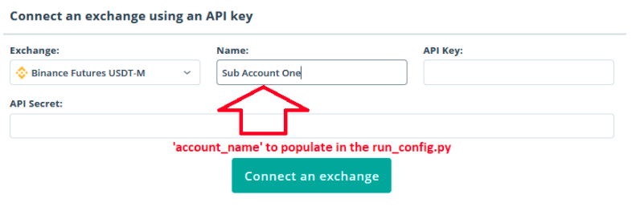
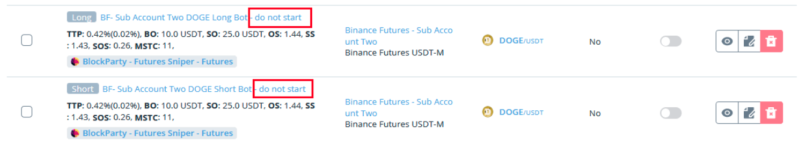

# Quick Start...   By Issac

## Step #1:
### Download the code from github
go to https://github.com/JeeZues/TradeBot/releases/latest and download the latest release



## Step #2:

Extract the downloaded files to a location of your choosing.. Example Extract to desktop

## Step #3:

Open the run_config.py file in a text editor such as notepad or Notepad++ and follow the instructions.. You will need to create a 3commas api and binance api and enter the api information in that file. The  ‘account_name’ should be exactly what you called it in 3Comma’s when you setup your API to link 3comma’s to Binance.



## Step #4:
ensure you have python:

### Windows:
open Command Prompt and type “python” and it should tell you what version you have installed, needs any version of python3, if you get an error you will need to install python. If python3 is installed you will also need to type in terminal “pip install -r requirements.txt” and it should download in Command Prompt.

### Mac:
open terminal and type “python3” .. if it is installed it will give you the version of python you have installed.. needs any version of python3. If python3 is installed you will also need to type in terminal “pip3 install -r requirements.txt” and it should download in terminal.

https://www.python.org/ - To install python


## Step #5:
So now you should have the api information populated in the run_config.py file and ensured that python3 is installed on your computer, you are ready to run the script


### Windows:
Open command prompt
Navigate to the location of the files you downloaded from github example, if you saved it on your desktop type the following in command prompts.
```
cd desktop
cd tradebot-main
```
Now you are ready to run the script, type the following in command prompt
```
py run.py -h                            🡨 This will bring up the help menu
py run.py --show_all --beep --colors --auto --keep_running --stop_at 1 --start_at .9 --pair_allowance 500 --binance_account_flag "Main"            🡨 example of a run     command, look at the help menu and choose your own settings
```

### MAC:
Open terminal
Navigate to the location of the files you downloaded from github example, if you saved it on your desktop type the following in command prompts.
```
cd desktop
cd tradebot-main
```
Now you are ready to run the script, type the following in command prompt
```
Python3 run.py -h                            🡨 This will bring up the help menu
Python3 run.py --show_all --beep --colors --auto --keep_running --stop_at 1 --start_at .9 --pair_allowance 500 --binance_account_flag "Main"            🡨 example of a run     command, look at the help menu and choose your own settings
```

## MISC Notes:
If you want to keep the script from opening a specific pair that you have setup in 3commas but do not want to delete it for historical information add “- do not start” to the end of the name and the script will ignore that pair and not open/start it. 


